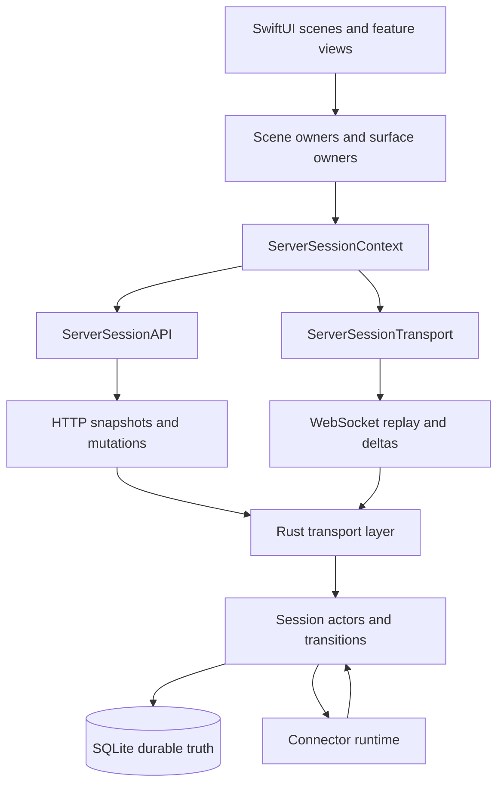

# OrbitDock Data Flow Contract

This is the transport source of truth for OrbitDock.

If a client-side implementation fights this document, treat the code as the thing that needs to move.

The short version:

- HTTP owns bootstrap, pagination, and mutation responses.
- WebSocket owns realtime follow-up, replay, heartbeats, and explicit refetch hints.
- The Rust server owns durable business truth.
- The native app renders server state through explicit scene and surface owners.
- `ServerSessionContext` is a scoped dependency bag, not product state.

## Core Contract

OrbitDock uses a surface-based transport model.

Each rendered surface should have:

- one owner
- one HTTP authority
- one realtime follow-up path

Examples:

- global sessions summary
- dashboard
- library
- missions
- session detail
- conversation
- control deck UI
- review canvas
- skills
- MCP servers

The client should not rebuild all session UI from one giant mutable session blob.

## Transport Roles

### HTTP

HTTP is authoritative for:

- initial snapshot loads
- pagination
- heavy payloads
- mutation responses
- targeted refetch after invalidation or replay failure

HTTP is the only normal bootstrap path.

### WebSocket

WebSocket is authoritative for:

- connection metadata
- replay from a known revision
- lightweight realtime deltas
- explicit refetch or resync hints

WebSocket should not become a second bootstrap channel for large surface snapshots.

## Client Ownership Model

The native app should follow this shape:

1. scene owners resolve stable dependencies
2. feature owners bootstrap and render one surface
3. `ServerSessionContext` exposes a narrow session API and realtime transport

That means:

- scene owners resolve the `ServerEndpointRuntime` before mounting child features
- feature owners decide which HTTP snapshot to load and which realtime feed to observe
- child views render state passed to them explicitly

The client should not:

- mount against placeholder production stores
- let multiple child features independently bootstrap the same surface
- treat websocket events as the primary business-state model

## Session Runtime Contract

`ServerSessionContext` should stay boring.

It may:

- scope one session to one endpoint runtime
- expose `api` for typed HTTP bootstrap and mutations
- expose `transport` for websocket follow-up, replay, and reconnect recovery

It should not:

- become a shared session view model
- own feature presentation state
- synthesize every screen from one mixed state object

## Architecture Diagram

## Surface Bootstrap Rules

### Global Sessions Summary

- HTTP: `GET /api/sessions/summary`
- WS follow-up: sessions-summary invalidation
- Owner: app runtime shell owner

This surface exists for app-wide attention, endpoint health, and notification-driving state.

It must stay compact.

`control plane` is reserved for runtime endpoint-role and sync-topology concerns, not UI surface naming.

### Dashboard

- HTTP: `GET /api/sessions/active`
- WS follow-up: dashboard invalidation
- Owner: dashboard scene or dashboard view model

Dashboard should stay focused on active work, not cold archive browsing.

### Library

- HTTP: `GET /api/sessions/archive`
- WS follow-up: library invalidation or explicit refresh while open
- Owner: library scene or library view model

Library is a cold surface. It should not be eagerly loaded just because dashboard or notifications need a smaller summary.

### Missions List

- HTTP: `GET /api/missions`
- WS follow-up: missions invalidation
- Owner: mission list scene or mission list view model

### Mission Detail

- HTTP: `GET /api/missions/{id}`
- WS follow-up: mission-specific invalidation or heartbeat
- Owner: mission detail scene or mission detail view model

### Session Detail Shell

- HTTP: selected-session bootstrap snapshot
- WS follow-up: detail-specific invalidation or replay
- Owner: session detail scene

### Conversation

- HTTP bootstrap: `GET /api/sessions/{id}/conversation?limit=...`
- HTTP pagination: `GET /api/sessions/{id}/messages?before_sequence=...&limit=...`
- WS follow-up: conversation row replay, row deltas, or explicit conversation resync
- Owner: conversation view model

### Other Session Surfaces

This includes control deck, review canvas, skills, and MCP servers.

- HTTP: surface-specific authoritative snapshot
- WS follow-up: surface-specific invalidation or replay hint
- Owner: the matching feature owner for that surface

These surfaces should not refresh because of a broad unrelated per-session event.

## Boot Sequences

### Dashboard Boot

1. WebSocket connects and receives `hello`.
2. The dashboard owner fetches `GET /api/sessions/active`.
3. The owner applies the snapshot and stores its revision.
4. The owner subscribes to dashboard follow-up from that revision.

There should not be parallel eager dashboard bootstraps from sibling views.

### Library Boot

1. The library owner becomes active.
2. The owner fetches `GET /api/sessions/archive`.
3. The owner applies the page and any paging cursor or offset.
4. The owner optionally subscribes to library follow-up while open.

Library should not be treated like an always-hot global cache.

### Session Detail Boot

1. The session detail scene resolves the real `ServerEndpointRuntime`.
2. The scene decides which surfaces are visible.
3. Each visible surface owner performs exactly one HTTP bootstrap.
4. Each surface owner subscribes to its own follow-up stream from the returned revision.

If one intentional selected-session bootstrap hydrates multiple closely related surfaces, that is fine.

What is not fine:

- conversation bootstrapping itself one way
- session detail bootstrapping it another way
- a shared session observer bootstrapping it a third way

## Mutation Rules

Successful mutation responses are authoritative.

For a user action:

1. send the HTTP request
2. apply the successful response immediately
3. let websocket follow-up reconcile afterward

Do not wait for a later websocket event when the HTTP response already contains the accepted state.

## Replay And Resync Rules

- Every replayable realtime feed should accept a revision or equivalent cursor.
- If the server can replay from that revision, it sends only the missing events.
- If replay cannot satisfy the gap, the server tells the client to refetch the matching HTTP surface.
- The client refetches the exact affected surface, not unrelated state.

This is especially important for reconnects. Replay gaps should trigger targeted recovery, not full-screen rebuilds.

## Memory And Efficiency Rules

- Do not keep multiple heavyweight copies of the same cross-endpoint session data in memory.
- Do not use dashboard payloads as the archive system.
- Do not use library payloads as the notification or attention system.
- Keep app-shell global state summary-sized.
- Keep cold surfaces cold until the user actually opens them.

## Conversation Exception

Conversation is the one normal surface that may apply realtime payloads directly.

That works because conversation rows are:

- server-assigned
- sequence-based
- replayable
- append/update oriented

So conversation may:

- bootstrap from HTTP
- append or update rows from websocket
- refetch from HTTP only for pagination or explicit conversation resync

For most other surfaces, websocket should be treated as a signal to refresh authoritative HTTP state.

## Durable Session Authority

The server owns durable session truth such as:

- `control_mode`
- `lifecycle_state`
- `accepts_user_input`
- `steerable`
- `can_interrupt`

The client may derive presentation from those fields, but it must not infer them from:

- connector runtime maps
- missing channels
- transcript content
- partial websocket payloads

If the client needs a durable fact, add it to the server contract.

## Anti-Patterns

Do not introduce:

- dual bootstrap paths for the same surface
- websocket-only large surface loads
- broad per-session refresh loops for unrelated surfaces
- client-side business-state inference
- a god-object session store
- send flows that wait for websocket before showing the accepted response
- replay recovery that rebuilds unrelated UI

## Practical Summary

When you touch the native client:

- start from the owning scene
- give each rendered surface one owner
- use HTTP for authority
- use websocket for follow-up
- keep `ServerSessionContext` narrow
- keep `ServerSessionAPI` and `ServerSessionTransport` boring
- refresh only the surface that actually changed

When you touch the server:

- keep durable state in the transition system
- persist and broadcast together
- use websocket for deltas and refetch hints, not heavy bootstrap payloads
